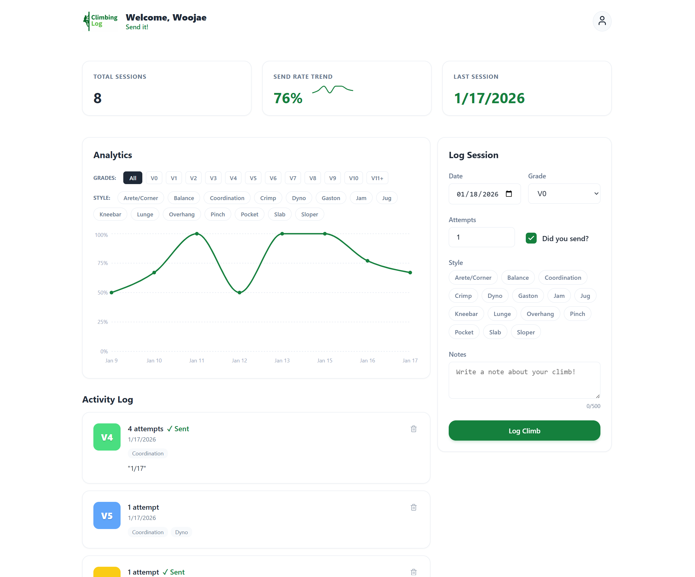

# Climbing Log 🧗‍♂️

A modern, mobile-responsive web application for tracking your bouldering sessions. Visualize your progress, analyze your send rates, and keep a detailed log of every climb.

**Note:** This project is created by me, the owner of the GitHub repository with the use of AI tools, mainly Antigravity with Gemini 3 Pro. I did not write the bulk of the code, but I did provide all requirements and specifications for the project. This project is a work in progress and I plan to make future updates to it.



## Features ✨

*   **Session Logging**: Quickly log climbs with details like Grade (V0-V11+), Attempts, Sent status, and Tags (Jug, Crimp, Slab, etc.).
*   **Visual Analytics**:
    *   **Interactive Charts**: Analyze your send rate trends over time.
    *   **Sparklines**: See immediate trend lines on your dashboard stats.
    *   **Filtering**: Filter analytics by Grade or Climbing Style.
*   **Mobile Optimized**: Fully responsive layout that adapts to your device.
    *   **Desktop**: Efficient side-by-side grid layout.
    *   **Mobile**: Streamlined stacked layout with "Sticky" headers disabled for better usability.
*   **User Profiles**: Persistent display names and personalized greetings.
*   **Secure**: Built on Supabase Auth with Row Level Security (RLS) ensuring your data is private.

## Tech Stack 🛠️

*   **Framework**: [Next.js 15](https://nextjs.org/) (App Router)
*   **Language**: TypeScript
*   **Styling**: Vanilla CSS (Variables, Responsive Grid, Flexbox)
*   **Database & Auth**: [Supabase](https://supabase.com/)
*   **Charts**: [Recharts](https://recharts.org/)

## Getting Started 🚀

### Prerequisites
*   Node.js 18+ installed.
*   A Supabase account (free tier is sufficient).

### Installation

1.  **Clone the repository**
    ```bash
    git clone https://github.com/YOUR_USERNAME/climbing-log.git
    cd climbing-log
    ```

2.  **Install dependencies**
    ```bash
    npm install
    ```

3.  **Environment Setup**
    Create a `.env.local` file in the root directory:
    ```env
    NEXT_PUBLIC_SUPABASE_URL=your_supabase_project_url
    NEXT_PUBLIC_SUPABASE_ANON_KEY=your_supabase_anon_key
    ```

4.  **Database Setup**
    *   Go to your Supabase Dashboard > SQL Editor.
    *   Copy the contents of `schema.sql` (found in this project's root).
    *   Run the SQL query to create the `climbs` and `profiles` tables and security policies.

5.  **Run Development Server**
    ```bash
    npm run dev
    ```
    Open [http://localhost:3000](http://localhost:3000) in your browser.

## Project Structure

*   `/app`: Next.js App Router pages and layouts.
*   `/app/components`: Reusable UI components (ClimbChart, LogClimbForm, SparklineChart).
*   `/app/globals.css`: Global styles, theme variables, and responsive utility classes.
*   `schema.sql`: Database definition file.
